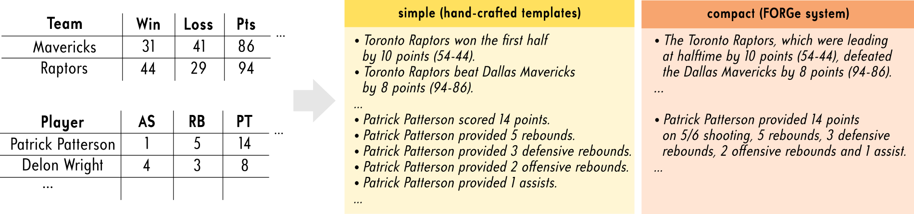
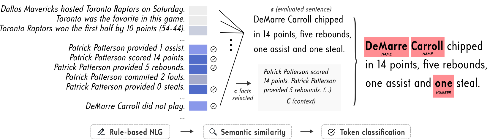
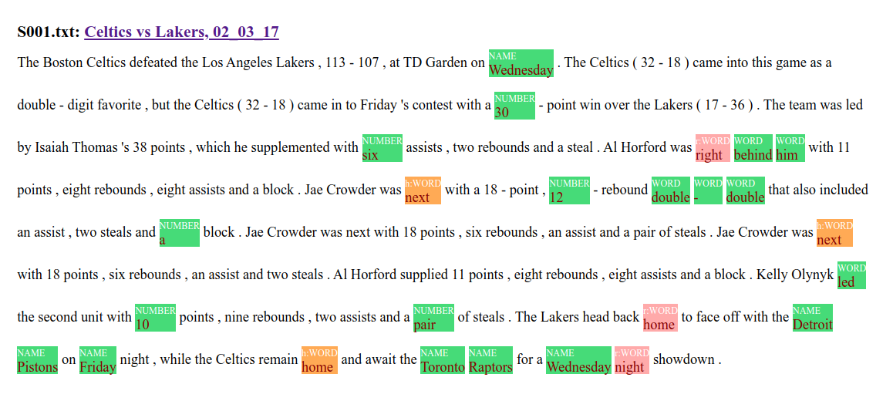

# Token-Level Error Detection for Table-to-Text Generation

Code for the CUNI & UPF submission for the [Shared Task in Evaluating Accuracy](https://github.com/ehudreiter/accuracySharedTask).

The code allows to train, evaluate, and run the models for **automatic token-level detection of factual errors** in the generated descriptions for the [Rotowire](https://github.com/harvardnlp/boxscore-data) tabular data.


For the detailed description of our system, please refer to:

 > Zdeněk Kasner, Simon Mille & Ondřej Dušek (2021): [Text-in-Context: Token-Level Error Detection for Table-to-Text Generation](https://aclanthology.org/2021.inlg-1.25.pdf) In: *Proceedings of the 14th International Conference on Natural Language Generation (INLG 2021)*.

## Quickstart
If you want to quickly try out the trained model using a command-line interface, follow these steps:
1. Install the requirements:
```bash
pip install -r requirements.txt
```
2. Download the trained checkpoint used for the submission: https://owncloud.cesnet.cz/index.php/s/lrmTSyBP9GobnVO/download
3. Place the checkpoint in the `experiments` directory:
```bash
cd accuracySharedTask_CUNI-UPF
mkdir -p experiments/full_compact_r0.25_ctx40
mv DOWNLOAD_DIR/model.ckpt experiments/full_compact_r0.25_ctx40
```
4. Unpack the data (generated facts + preprocessed Rotowire data):
```bash
unzip data_unpack.zip
```
5. For annotating the errors using automatic context retrieval for the game GAME_ID, run the following command:
```bash
./interact.py \
    --game_idx GAME_ID \
    --experiment "full_compact_r0.25_ctx40" \
    --templates compact \
    --ctx 40
```
Prompt for inputting the sentence (`[Sentence]:`) will be displayed. You can use `games.csv` for sentence examples. Use the number in the `LINE_ID_FROM_TEST_SET` column as a GAME_ID. If you want to use a custom context, omit the `--game_idx` argument and input the context manually.

*Note*: Sentences are tokenized by default. If you use the pre-tokenized sentences, use the parameter `--is_tokenized`.

Example:
- GAME_ID=563
- sentence: *The Boston Celtics defeated the Los Angeles Lakers, 113-107, at TD Garden on Wednesday.*
- output (*O*=OK, the token *Wednesday* is tagged with the *NAME* error):
```
[('The', 'O'),
 ('Boston', 'O'),
 ('Celtics', 'O'),
 ('defeated', 'O'),
 ('the', 'O'),
 ('Los', 'O'),
 ('Angeles', 'O'),
 ('Lakers', 'O'),
 (',', 'O'),
 ('113-107', 'O'),
 (',', 'O'),
 ('at', 'O'),
 ('TD', 'O'),
 ('Garden', 'O'),
 ('on', 'O'),
 ('Wednesday', 'NAME'),
 ('.', 'O')]
```


## Model Overview
### Rule-based NLG
First, a rule-based NLG system is applied on the original Rotowire tabular data. The system is based either on hand-crafted templates (*simple*) or FORGe NLG (*compact*).



Note that the code for running the rule-based NLG systems is **not included** in the repository (the rule-based NLG system outputs are precomputed in `data_unpack.zip/context`).

### Automatic token-level error detection
For detecting errors in a sentence, *c* facts generated for the respective game (parameter `--ctx`) with the highest semantic similarity are selected. The semantic similarity is computed using `paraphrase-distilroberta-base-v2` from [SentenceTransformers](https://www.sbert.net/
). 

The sentence and the context is given as an input to a pretrained [RoBERTa](https://huggingface.co/transformers/model_doc/roberta.html#robertafortokenclassification) LM with a token classification head, which outputs error labels for each token.




## Usage Instructions

### Requirements
- Python 3 & pip
- packages: see `requirements.txt` for the full list

All packages can be installed using
```bash
pip install -r requirements.txt
```

### Preprocessing
#### Unpacking the data
The facts generated with the rule-based NLG systems and the preprocessed Rotowire data are included in `data_unpack.zip`. The file needs to be unpacked prior to preprocessing:
```bash
unzip data_unpack.zip
```
#### Preprocessing human-annotated data
Use the script `generate.py` for preprocessing the human-annotated data from the shared task.

Example (using *compact* templates):
```bash
./generate.py \
    --templates compact \
    --annotations gsml.csv \
    --games games.csv \
    --output ann_compact
```
For generating the test splits for the 6-fold cross-validation, use the parameter `--xval_splits 6`. The splits will be divided into subdirectories numbered from 0 to `xval_splits`-1. Cross-validation is necessary only for development - if a separate test dataset is used (see the `test` directory), all human-annotated data can be used for training. 

#### Generating synthetic data
Use the script `generate.py` for generating the synthetic data. The data is generated by adding noise to the original Rotowire human-written references.

Example (using *compact* templates and entity modification rate *0.25*):
```bash
for SPLIT in train dev test; do
    ./generate.py \
        --modification_rate 0.25 \
        --templates compact \
        --output syn_compact_r0.25 \
        --split $SPLIT
done
```
The generated data will appear the `data` folder.

Note that the process may take a while. For generating only a subset of the data (e.g. for parallelizing the process), use the parameters `--start` and `--end` denoting the first and last game numbers, respectively.

| Rotowire split  |  # of games |
|---|---|
| train  | 3396  |
|  dev | 726  |
|  test | 727  |


For both human-annotated and synthetic data, the versions of the dataset using context sizes 5, 10, 20 and 40 are generated automatically. If you wish to specify a custom context size, use the parameter `--ctx`. The context size is denoted in the folder name by suffix `_ctx{CONTEXT_SIZE}`.

### Training
Context size 40 is used in all the examples.
#### Human-annotated data
For training the model on the **human-annotated** data, use the following command:
```bash
./train.py \
    --dataset ann_compact_ctx40 \
    --experiment ann_compact_ctx40 \
    --max_epochs 10 \
    --gpus 1
```

#### Synthetic data
For training the model on the **synthetic** data (EMR=0.25), use the following command:
```bash
./train.py \
    --dataset syn_compact_r0.25_ctx40 \
    --experiment syn_compact_r0.25_ctx40 \
    --max_epochs 10 \
    --gpus 1
```

#### Human-annotated + synthetic data
For training the model on both the **synthetic** and **human-annotated** data:
1. Train the model on the synthetic data (see the previous section).
2. Load the trained checkpoint and further train it on human-annotated data:
```bash
./train.py \
    --dataset ann_compact_ctx40 \
    --experiment syn_ann_compact_ctx40 \
    --max_epochs 10 \
    --gpus 1 \
    --model_path experiments/syn_compact_r0.25_ctx40/model.ckpt
```

### Decoding
For applying the trained model (syn+ann) on generated sentences provided in `games.csv`, use the following command:
```bash
./decode.py \
    --experiment syn_ann_compact_ctx40 \
    --input_file games.csv \
    --templates compact \
    --ctx 40
```
The model will produce the file `out.csv` with annotations in the experiment directory.

**Note:** the model outputs an individual error category for each token. Due to the way the precision is computed, this may hurt the precision score with multi-token errors. In order to fix this, use the script `./postprocess_submission.py` for postprocessing the model output:

```bash
./postprocess_submission.py experiments/syn_ann_compact_ctx40/out.csv
```

### Evaluation
An evaluation script provided by the shared task organizers is included in the repository. The script is slighly modified, producing a more compact output and including an option to average results over cross-validation splits.

Evaluating the `output.csv` from the syn model (without cross-validation): 
```bash
./evaluate.py \
    --gsml gsml.csv \
    --submitted experiments/syn_compact_r0.25_ctx40/out.csv \
    --token_lookup token_lookup.yaml
```

Evaluating the `output.csv` from the syn+ann model (averaging over 6 cross-validation splits): 
```bash
./evaluate.py \
    --gsml gsml.csv \
    --submitted experiments/syn_ann_compact_ctx40/out.csv \
    --token_lookup token_lookup.yaml \
    --avg_xval 6
```
## Miscellaneous

### Submission
The file `submission.csv` output contains the output from our system for the shared task. The test data are included in the `test` directory.

### Visualization
The script `utils/gsml_to_html.py` can be used for generating a HTML file for visualizing the identified errors:

Sample output:


Colors:
- **green**: error is identified correctly
- **orange**: error is identified although the token is ok
- **red**: error is not identified
- **purple**: error category is identified incorrectly

## Citation
```
@inproceedings{kasner-etal-2021-text,
    title = "Text-in-Context: Token-Level Error Detection for Table-to-Text Generation",
    author = "Kasner, Zden{\v{e}}k  and
      Mille, Simon  and
      Du{\v{s}}ek, Ond{\v{r}}ej",
    booktitle = "Proceedings of the 14th International Conference on Natural Language Generation",
    month = aug,
    year = "2021",
    address = "Aberdeen, Scotland, UK",
    publisher = "Association for Computational Linguistics",
    url = "https://aclanthology.org/2021.inlg-1.25",
    pages = "259--265"
}
```
